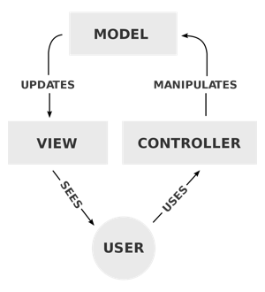

# Java_GUI_MVC

Github Link: [https://github.com/silentrald/java-gui-mvc](https://github.com/silentrald/java-gui-mvc)

### Requirements

Basic MVC(Model-View-Controller) in Java using Java swing

Prereq: Basic Java Programming

### MVC (Model, View, Controller)

By use:

- Model
  - All the stored data should be kept here.
  - Anything DB related is here.
- View
  - GUI, what the user sees.
- Controller
  - Communicates with both the view and the model.
  - Tells the model to update the values.
  - Updates the current view that the user sees.



Looking at the image above, this is the diagram of how the MVC Architecture works. When a user interacts with anything in the **view**, the **controller** will receive that and then it might update some values in the **model** and update the **view** that the users sees.

**NOTE**

The model does not know what the view is and the view does not know what is the current model is.

### Model

This is the easiest part to code in the MVC Model. This just contains all the variables we need to store and can only be accessible by getters and setters. So in my sample `Model.java`, the snippet goes like this:

```java
    ...
    // Variables
    private String txt;

    ...
    // Methods
    public String getTxt() {
        return txt;
    }

    public void setText(String txt) {
        this.txt = txt;
    }

    ...
```

We only declare a **String** object called **txt** and we create its getters and setters. So any value that is needed to be stored by the program should only reside in this part of the code.

### View

This is the GUI(Graphical User Interface) of your program. With the sample code in `View.java`, I used the swing class which is already inside the java class and to follow the steps below.

**Note:** whenever we instantiate an Object that is not part of the default Java Objects, just search it in google and add the library here or use an IDE like Eclipse to automatically add the libraries for you.

1. Within the constructor, we need to create a window for the application:

```java
// Name of the window
frame = new JFrame("Titlebar Name");
frame.setSize(800, 600);    // Window Size
frame.setLayout(null);      // Just set it to null
frame.setVisible(true);     // Default is false, that is why we need to set visibility to true

// On default, the close [x] button will do nothing so
// we have to set it to JFrame.EXIT_ON_CLOSE which will
// close the window properly
frame.setDefaultCloseOperation(JFrame.EXIT_ON_CLOSE);
```

(You can test the code above, just initialize it in a main function and see if a windows pops up)

2. To add a text/label on the window

```java
label = new JLabel("Hello");            // Initialize the label with a text
label.setBounds(100, 100, 100, 25);     // Sets the absolute position and size of the component to the window
frame.add(label);                       // Add the component to the window/frame
```

**The component is needed to be added in the frame so that it will show on the window**

3. To add a text field on the window

```java
text = new JTextField();            // Initialize the text field without any text value
text.setBounds(100, 200, 100, 25);  // Sets the absolute position and size of the component to the window
frame.add(text);                    // Add the component to the window/frame
```

4. To add a button on the window

```java
button = new JButton("CLICK ME");       // Initialize the button with a text
button.setBounds(100, 300, 100, 25);    // Sets the absolute position and size of the component to the window
frame.add(button);                      // Add the component to the window/frame
```

5. Last is to update the window

```java
frame.revalidate();
frame.repaint();
```

6. Add the getters and setters for each component in the view such as the label and text field

7. For the button, we need to add an action listener so that when a button is pressed, then whatever function that was passed in the variable **listener** will be run.

**The view has no logic, only the controller has the logic to the button press, later this will be linked in the controller part**

```java
public void addButtonActionListener(ActionListener listener) {
    button.addActionListener(listener);
    // Since the listener will be set only when it is
    // initialized in the controller, the button here
    // will do nothing when this method is not called
}
```

There are still a lot of components not used in this tutorial. Here is a list and the Java Class Link in Oracle:

- Link
- Link
- Link

## Controller

In the controller, here is where we add functionality to buttons or keypress with something called as an **event listener**. The method in view that sets the event listener where when we press the button the label will change it's text

```java
// Adds functionality when the button is clicked
view.addButtonActionListener((ActionEvent e) -> {
    // This will change the JLabel to what the JTextField value is
    view.setLabelText(view.getText());
});
```

### To Run

To run on Windows just run the commands in the `run.bat` file on the
console on the same directory or you can double click the file instead

---

To run on Mac/Linux just run the commands in the `run.sh` file on the
console on the same directory or you can type on the console

```
<filepath to the folder>/Java_GUI_MVC$ .\run.sh
```

To test the program, so whenever you type a text in the field and press the button, it should update the label's text to the value within the text field.
